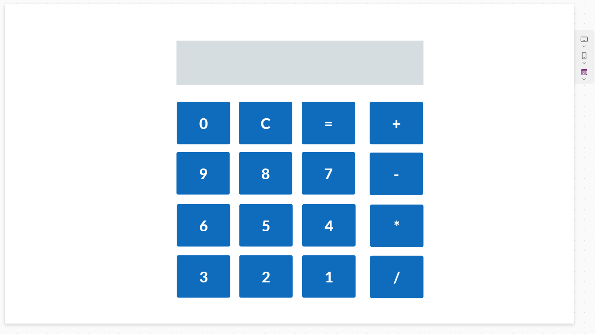
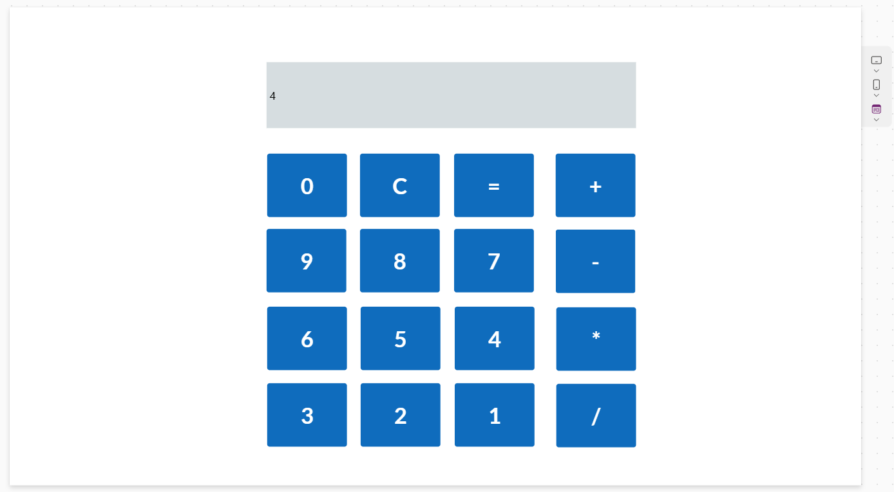

# 🧮 Calculator (PowerApps)

This is a basic calculator app built using **Microsoft PowerApps**. The app performs standard arithmetic operations such as addition, subtraction, multiplication, and division. It's designed with a clean and user-friendly interface for fast and easy calculations.

---

## ✨ Features

- ➕ **Addition**
- ➖ **Subtraction**
- ✖️ **Multiplication**
- ➗ **Division**
- 🔄 **Clear** button to reset input
- ✅ Instant result display

---

## 🖼️ Screenshot

*A simple and responsive PowerApps calculator UI.*

---
